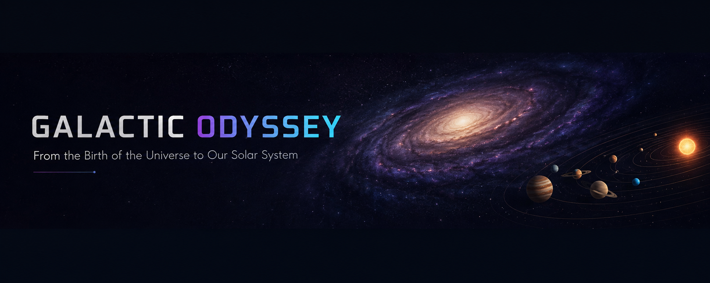

  

🌌 Galactic Odyssey

Interactive Cosmic Evolution Simulator

An interactive HTML-based educational simulator exploring the evolution of the Universe from the hot early Universe to the present Solar System, designed around Class 12 scientific concepts.

---

✨ Features

* Cosmic Evolution: Explore major stages of cosmic history.
* Expansion & Cooling: Visualize the evolution of the early Universe.
* Cosmic Web: Explore large-scale cosmic structures.
* Galaxy Formation: Visualize the emergence and evolution of galaxies.
* Interactive Exploration: Navigate and explore cosmic structures.
* Solar System Formation: Explore the formation and evolution of the Solar System.
* Responsive Design: Optimized for desktop, tablet, and mobile devices.

---

🎓 Learning Objectives

* Understand expansion and cooling of the early Universe.
* Explore cosmic structure and galaxy formation.
* Understand the gravitational role of dark matter.
* Visualize Solar System formation.
* Develop an intuitive understanding of cosmic time and scale.

---

🚀 Build & Hosting

* Repository: GitHub
* Hosting: GitHub Pages
* Frontend: HTML, CSS & JavaScript
* Rendering: Three.js / WebGL

---

🛠️ Credits & Acknowledgments

* Claude Anthropic: Code architecture.
* OpenAI:  Prompt generation & refinement.
* Moonshot AI:  Initial Code implementation.
* Perplexity: Scientific validation.

---

👤 Author

Draven Ashcroft

* M.Sc. Ag. Entomology
* ASRB NET
* DIPS Chain of Institutions

---

📜 License

GPL-3.0
